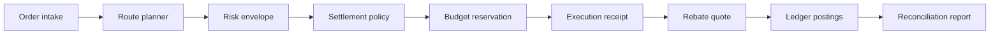
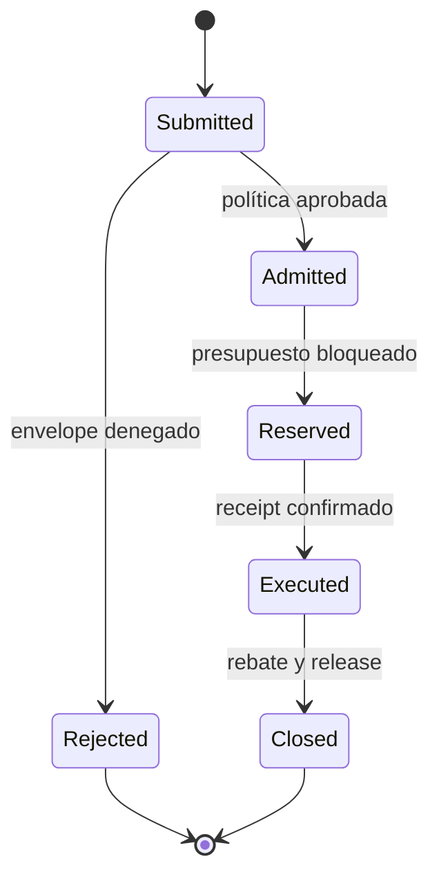
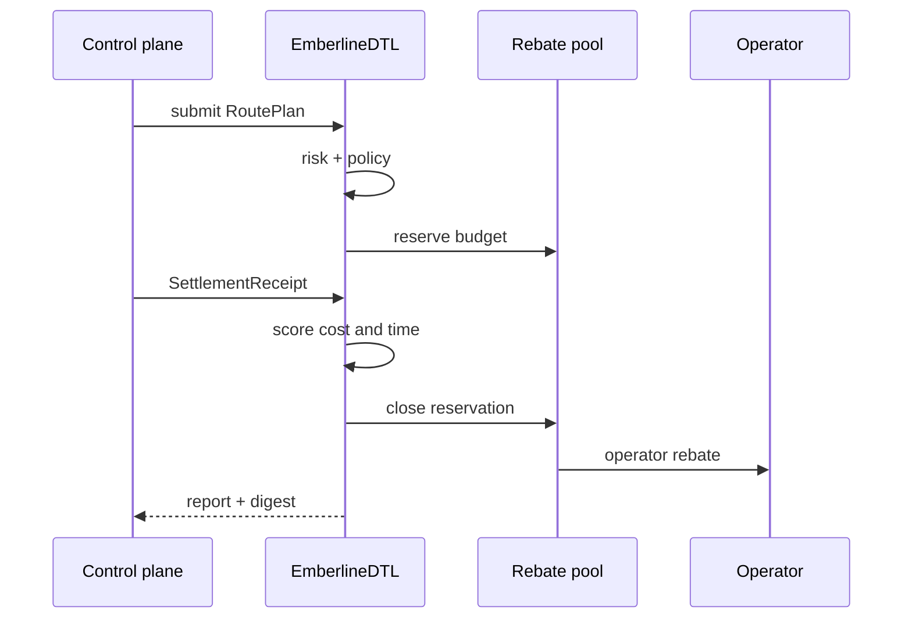
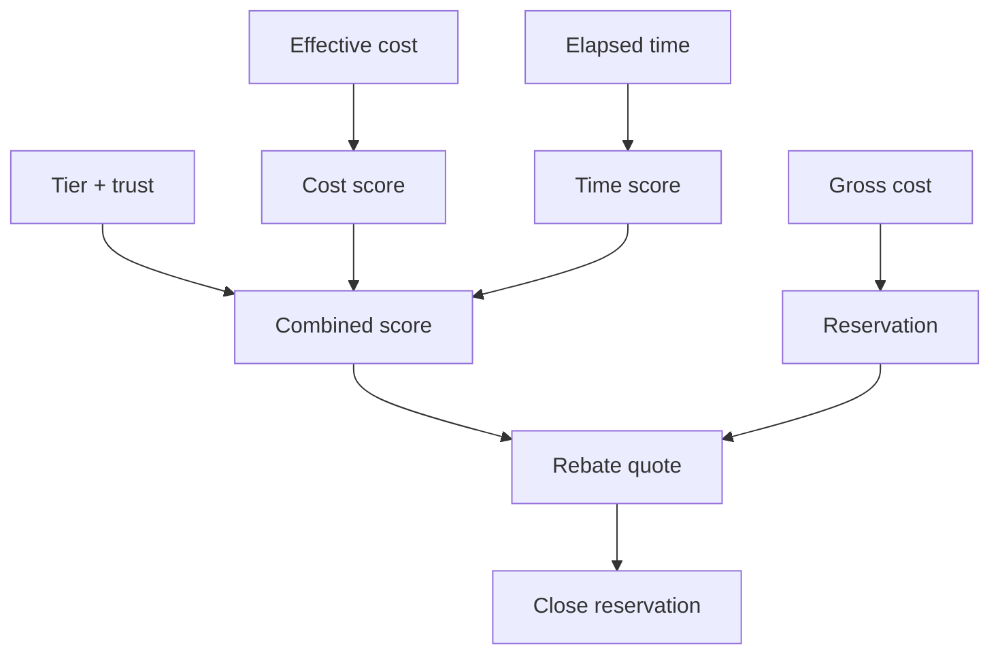

# EmberlineDTL


[](https://github.com/SolguardLabs/EmberlineDTL/actions/workflows/ci.yml)
[](https://github.com/SolguardLabs/EmberlineDTL/actions/workflows/release-integrity.yml)
[](https://www.rust-lang.org/)
[](https://nodejs.org/)

EmberlineDTL es un motor determinista de routing y settlement para redes de pago multirregión. Selecciona rutas por coste, latencia y reputación; reserva presupuesto en un pool por activo; liquida incentivos y penalizaciones; y entrega un informe reconciliable con journal y digest de estado.

El núcleo Rust ejecuta sin acceso de red ni estado externo. Los escenarios publicados ofrecen una interfaz reproducible para el plano de control, mientras el cliente JavaScript aporta límites de proceso, validación de respuesta y ejecución sin shell.

## Arquitectura



| Componente   | Responsabilidad                                     |
| ------------ | --------------------------------------------------- |
| `route`      | Planes, legs, costes, compensaciones y recibos.     |
| `risk`       | Admisión por envelope, operador y exposición.       |
| `policy`     | Reserva, scoring, rebate, penalización y release.   |
| `pool`       | Contabilidad de presupuesto disponible y reservado. |
| `settlement` | Orquestación de admisión y ejecución atómica.       |
| `ledger`     | Postings deterministas por cuenta y activo.         |
| `treasury`   | Stress de liquidez, concentración y cartera.        |
| `report`     | Contrato JSON, digests e invariantes.               |
| `sdk`        | Cliente JavaScript endurecido para el binario.      |

## Ciclo de una ruta





## Cálculo operativo

Las cantidades son enteros `u128` acotados. Los porcentajes se expresan en basis points. El motor calcula primero el coste bruto de los legs y una reserva con buffer y límite por tier:

```text
grossCost = Σ(quotedCost_i + externalFee_i)
reserveBuffer = policyBufferBps + operatorTierBufferBps
reserveAmount = min(grossCost × (1 + reserveBuffer), operatorReserveLimit)
```

En el cierre, coste y tiempo forman el score combinado junto con tier y trust score:

```text
combinedScore = 45% × costScore
              + 35% × timeScore
              + 10% × tierBoost
              + 10% × trustScore
```



## Modelo de tesorería

`src/treasury.rs` evalúa posiciones por activo sin mutar el motor transaccional:

```text
available = floor((poolAvailable + expectedInflow) × (1 - liquidityHaircut))
required = ceil(poolReserved × (1 + reservationShock))
         + ceil(scheduledRebates × (1 + rebateShock))
         + ceil(accumulatedPenalties × (1 + penaltyAddon))
         + ceil(largestReservation × concentrationAddon)
surplus = max(available - required, 0)
shortfall = max(required - available, 0)
```

El resultado incluye coverage, utilización, concentración, bandas `nominal`, `watch`, `guarded`, `critical` y señales deterministas.

## Inicio rápido

Requisitos: Rust `1.96.0`, Node.js `24.x` y Bash.

```bash
npm ci
cargo run --locked -- --list
cargo run --locked -- scenario normal
cargo run --locked -- validate pool
npm run test:all
npm run ci
```

Cliente JavaScript:

```js
import { EmberlineClient } from "./sdk/client.js";

const client = new EmberlineClient({
  binaryPath: "target/release/emberline_dtl",
  timeoutMs: 5_000,
});

const report = client.runScenario("normal");
console.log(report.state_digest, report.pool);
```

En Windows, use `target/release/emberline_dtl.exe`.

## Documentación

- [Arquitectura](docs/01-arquitectura.md)
- [Routing y admisión](docs/02-routing-y-admision.md)
- [Economía de rebates](docs/03-economia-de-rebates.md)
- [Tesorería y stress](docs/04-tesoreria-y-stress.md)
- [Operación](docs/05-operacion.md)
- [Integración y observabilidad](docs/06-integracion-y-observabilidad.md)
- [Despliegue](docs/07-despliegue.md)
- [Política de seguridad](SECURITY.md)

## Garantías de ingeniería

- Aritmética entera comprobada y código Rust sin `unsafe`.
- IDs y digests BLAKE3 deterministas.
- Reserva segregada, journal y reconciliación por activo.
- Stress independiente de tesorería y agregación multi-activo.
- 11 pruebas Rust y 13 pruebas Node.
- CI Linux/Windows, formato, Clippy estricto y lockfiles.
- Promoción verificable entre `main`, `production`, tag y release.

## Licencia

Distribuido bajo los términos de [MIT](LICENSE).
