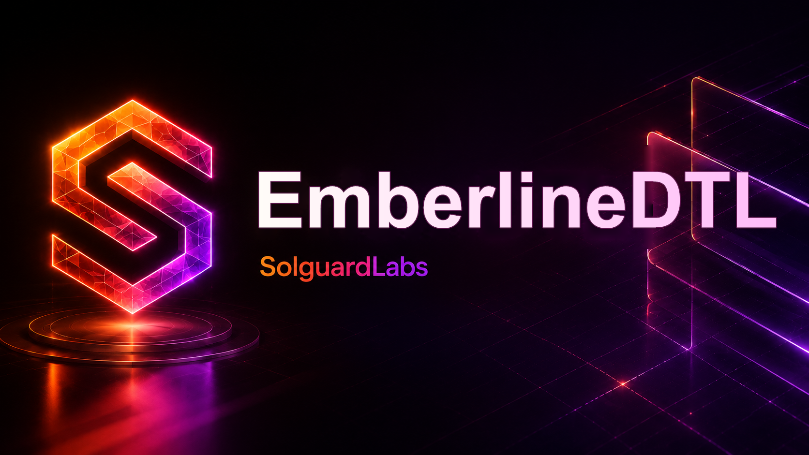

# EmberlineDTL



EmberlineDTL es un motor Rust para simular settlements DTL con rebates por
ejecucion eficiente. El protocolo modela rutas con varios legs, operadores con
tiers de reputacion, reservas de presupuesto desde un pool comun y reportes
JSON deterministas para auditoria.

El sistema esta pensado para validar comportamiento economico local sin servicios
externos. Los escenarios incluidos cubren ejecucion normal, comparacion de
rebates, penalizaciones por coste o latencia y accounting agregado del pool.

## Componentes

- `src/route.rs`: planes de ruta, legs y recibos de settlement.
- `src/policy.rs`: bandas de coste/tiempo y calculo de rebate.
- `src/pool.rs`: reservas, pagos, penalizaciones y release de presupuesto.
- `src/settlement.rs`: motor de admision, ejecucion y accounting.
- `src/report.rs`: contrato JSON consumido por tests e integraciones.
- `tests/node`: tests publicos sobre la CLI y los escenarios.

## Requisitos

- Rust `1.96.0`.
- Node.js `24` o superior.
- Bash para ejecutar los scripts de CI local.

## Uso

Listar escenarios:

```bash
cargo run -- --list
```

Ejecutar un escenario:

```bash
cargo run -- scenario normal
cargo run -- scenario rebate
cargo run -- scenario penalty
cargo run -- scenario pool
```

Validar un escenario:

```bash
cargo run -- validate normal
```

## Tests

```bash
cargo test --locked
node --test "tests/node/*.test.js"
```

O bien:

```bash
bash scripts/tests.sh
```

La validacion completa ejecuta formato, build, tests, clippy y control de LOC:

```bash
bash scripts/ci.sh
```

## Estado

El proyecto es autocontenido. Los reportes JSON son deterministas y estan
disenados para revisiones de logica economica, invariantes de pool y pruebas de
integracion sin infraestructura externa.
