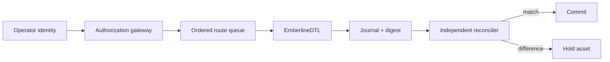
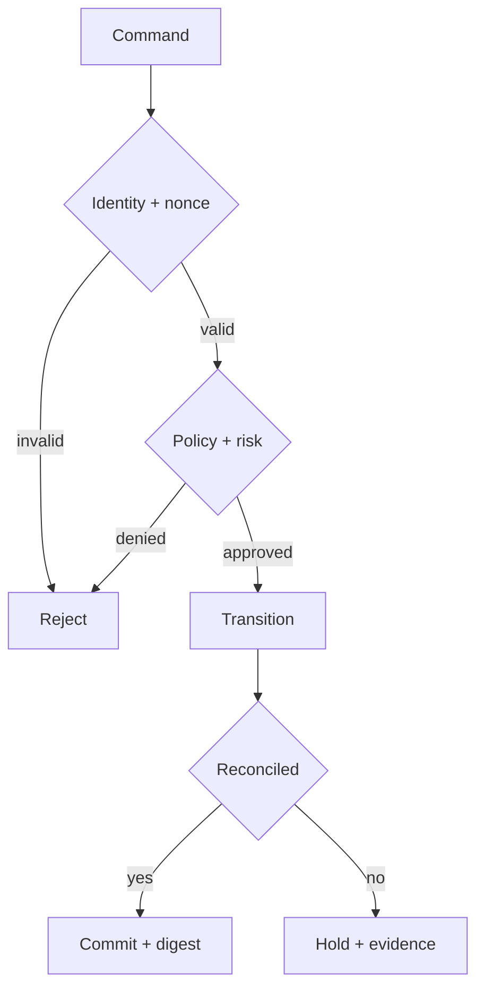

# Política de seguridad

## Versiones mantenidas

| Serie   | Estado            |
| ------- | ----------------- |
| `1.x`   | Mantenida         |
| `< 1.0` | Sin mantenimiento |

`main` contiene el estado integrado. `production` identifica el commit promovido y cada entrega estable usa un tag anotado `vMAJOR.MINOR.PATCH`.

## Límites de confianza

EmberlineDTL calcula rutas y asientos, pero no autentica identidades externas ni persiste snapshots. El integrador debe autenticar, autorizar, ordenar comandos, fijar políticas, almacenar evidencia y limitar recursos.



## Controles del integrador

- Asignar roles mínimos y negar por defecto.
- Aplicar idempotencia a route, reservation y settlement IDs.
- Serializar cambios por activo y versión de estado.
- Verificar expiración, network ID y política antes de ejecutar.
- Fijar timeout, memoria y tamaño máximo de stdout.
- Persistir input hash, binary hash, policy hash y output hash.
- Reconciliar pool, operadores y postings antes de confirmar.
- Detener nuevas reservas cuando la banda de tesorería lo exija.

## Invariantes



```text
pool.available >= 0
pool.reserved >= 0
closedReservation.paid + penalty + released = amount
route.operator = receipt.operator
route.id = receipt.route
operator.balance >= 0
ledger.poolAvailable = report.pool.available
```

Un informe correcto no sustituye autorización ni control de concurrencia. Los límites deben evaluarse sobre el snapshot vigente y los compromisos que aún no hayan cerrado.

## Comunicación responsable

Use **GitHub Security Advisories** en la pestaña Security. Evite issues públicos con escenarios de impacto económico.

Incluya versión, commit, plataforma, escenario mínimo, salida observada, impacto por activo, hashes y una prueba de regresión propuesta. El equipo confirmará recepción, reproducirá el caso en un entorno aislado y coordinará la publicación.

## Dependencias y secretos

El build no requiere secretos. CI usa lockfiles, permisos de solo lectura, Rust y Node fijados y acciones mantenidas. Credenciales de operación, firmas y datos personales pertenecen al plano de control y nunca deben aparecer en rutas, logs o artefactos.
