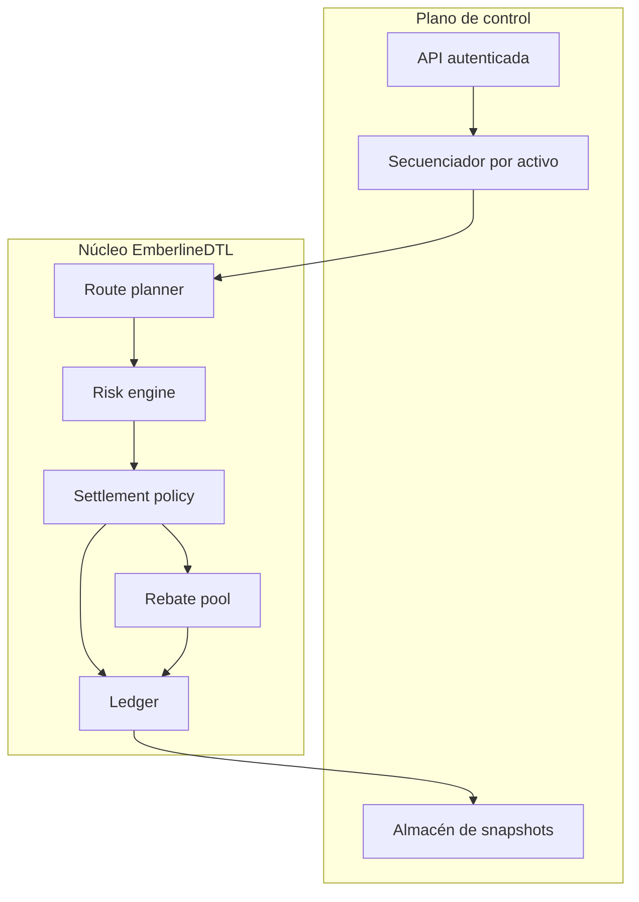
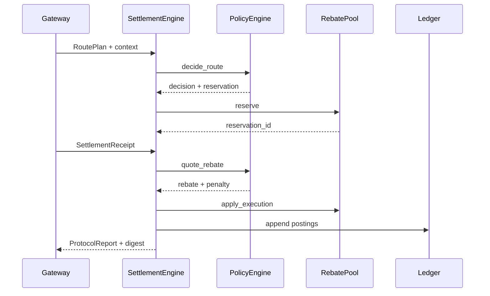
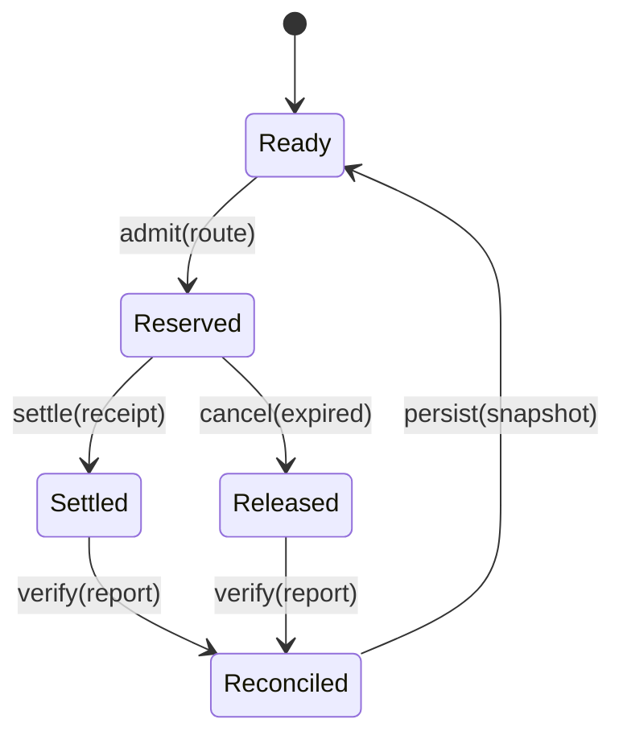

# Arquitectura del protocolo

EmberlineDTL separa la decisión de ruta, la custodia presupuestaria y la contabilización. El binario recibe un escenario determinista, construye un `RoutePlan`, aplica la política vigente y emite un reporte JSON reconciliable. Ningún módulo realiza llamadas de red ni consulta un reloj global.

## Capas y responsabilidades

| Capa     | Entrada                       | Salida                          | Propiedad principal                  |
| -------- | ----------------------------- | ------------------------------- | ------------------------------------ |
| Routing  | legs y operador               | plan normalizado                | coste y latencia agregados           |
| Riesgo   | plan, exposure, tier          | decisión de admisión            | límites independientes de settlement |
| Política | plan admitido y receipt       | reserva y quote                 | parámetros versionables              |
| Pool     | operaciones de reserva/cierre | saldos disponibles y reservados | conservación contable                |
| Ledger   | postings                      | balances y journal              | replay determinista                  |
| Reporte  | estado final                  | JSON y digest                   | contrato estable de integración      |

## Flujo de datos

Los IDs derivan de BLAKE3 sobre campos canónicos. Para repetir una transición deben conservarse el mismo snapshot, política, plan y receipt. Los consumidores no deben depender del orden incidental de mapas: el reporte ordena colecciones antes de calcular el digest.

## Modelo de estado

Cada comando se aplica sobre un único snapshot. El integrador debe serializar escrituras por activo o usar control optimista con versión. Ante una diferencia de digest, se descarta la salida completa y se conserva el snapshot anterior.

## Decisiones de diseño

- `u128` evita decimales binarios en importes; las unidades mínimas pertenecen al activo.
- Los basis points hacen explícita la precisión de tasas y haircuts.
- El journal mantiene la explicación económica de cada saldo.
- El modelo de tesorería es de solo lectura y puede ejecutarse antes o después de una ruta.
- El cliente JavaScript delimita proceso, tiempo y salida; el binario sigue siendo la autoridad de cálculo.
