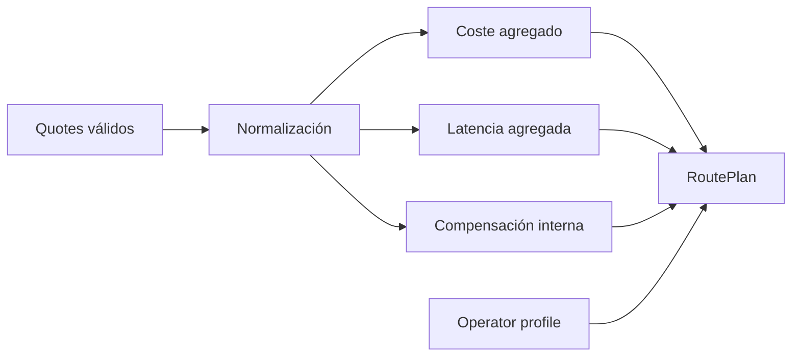
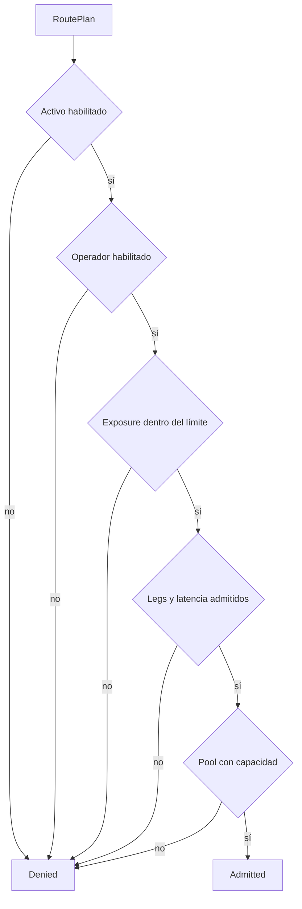
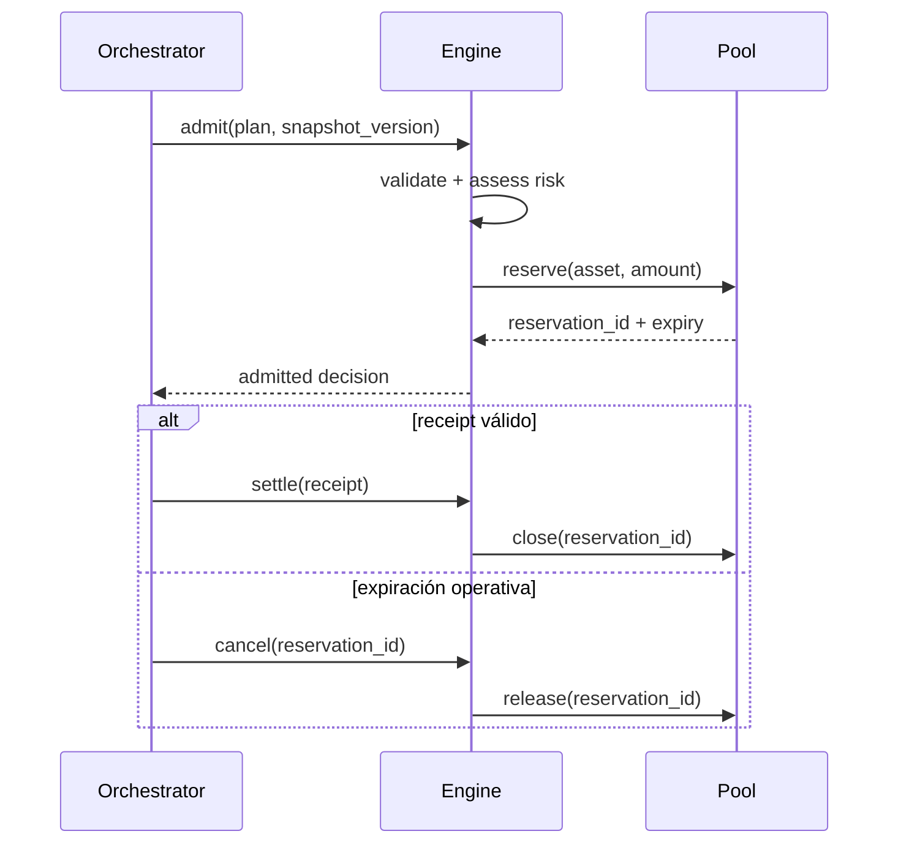

# Routing y admisión

Una ruta representa un conjunto ordenado de legs ejecutados por un operador. La admisión no elige únicamente el trayecto más barato: pondera coste declarado, comisiones externas, latencia, exposición por activo, calidad del operador y capacidad del pool.

## Construcción del plan



Un leg debe declarar red de origen, red de destino, importe, coste cotizado, comisión externa y tiempo esperado. El plan rechaza colecciones vacías, IDs repetidos, redes incoherentes y sumas que excedan `u128`.

```text
gross_cost = Σ(quoted_cost + external_fee)
expected_time_ms = Σ(expected_leg_time_ms)
effective_cost = gross_cost - min(internal_compensation, gross_cost)
```

## Envelope de riesgo



El envelope debe configurarse por activo y no por valor agregado de cartera. Una autorización sobre USDC no implica capacidad sobre otro activo. La versión de la política forma parte de la evidencia de ejecución.

## Reserva y expiración



La expiración es una decisión del plano de control porque el núcleo no consulta tiempo externo. El orquestador debe impedir que `settle` y `cancel` compitan sobre la misma reserva mediante un nonce o una escritura compare-and-swap.

## Perfil del operador

Los tiers expresan límites y buffers, no identidad. La autenticación del operador ocurre antes de crear el plan. Para cada operador se recomienda mantener:

- exposición viva por activo;
- tasa de rutas completadas y rechazadas;
- distribución de latencia frente al quote;
- penalizaciones abiertas y cerradas;
- versión del perfil usada en cada decisión.

Una reducción de tier no debe modificar retroactivamente reservas aceptadas. Debe aplicarse a la siguiente versión del snapshot y quedar reflejada en el journal de control.
