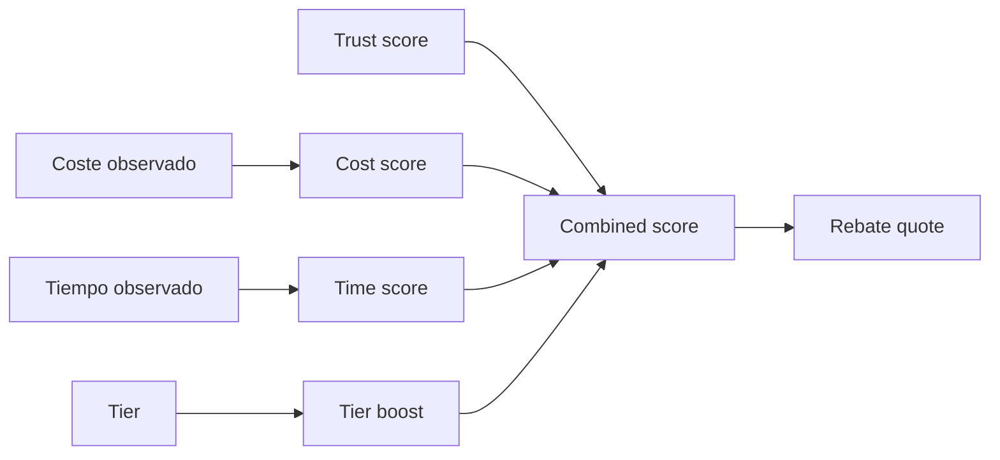
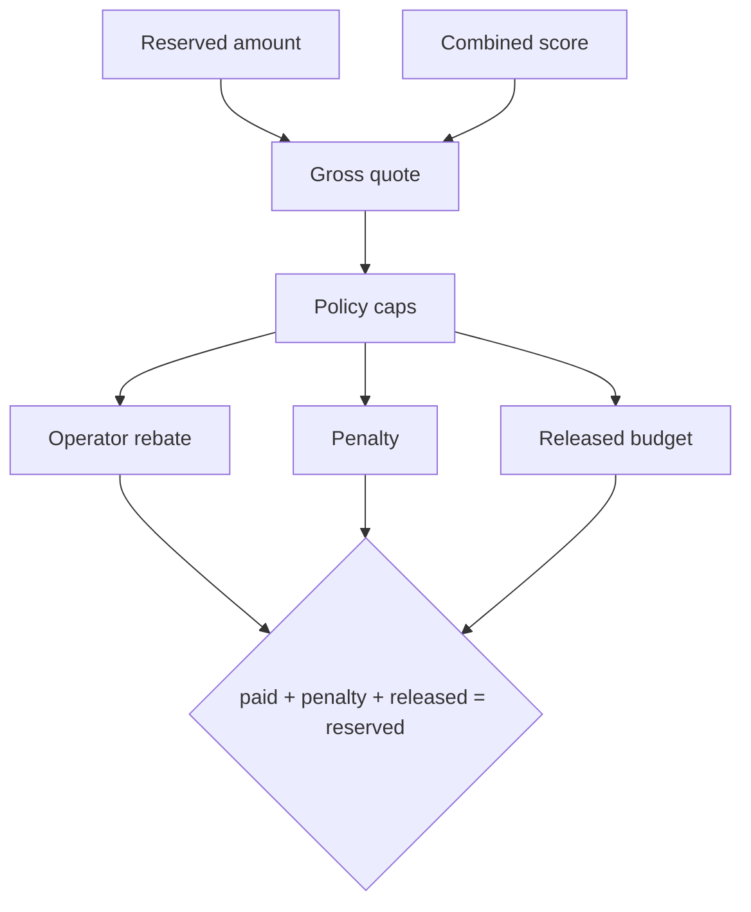
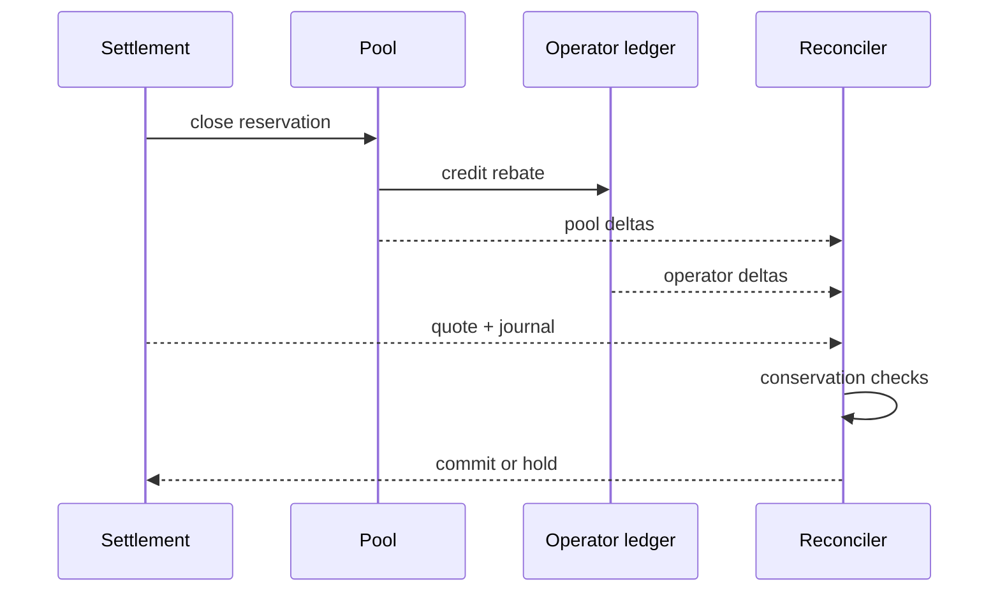

# Economía de rebates

El rebate remunera ejecución eficiente dentro de una reserva previamente aprobada. La política convierte el receipt en scores enteros, aplica los multiplicadores del operador y produce tres destinos contables: pago, penalización y liberación.

## Formación del score



Todos los scores están limitados a un dominio conocido. No se emplean `f32` ni `f64`; multiplicaciones y divisiones usan enteros comprobados y una política explícita de redondeo.

```text
cost_score = clamp(score_cost(actual_cost, quoted_cost), 0, 10_000)
time_score = clamp(score_time(actual_ms, quoted_ms), 0, 10_000)
combined = 4_500×cost_score/10_000
         + 3_500×time_score/10_000
         + 1_000×tier_boost/10_000
         + 1_000×trust_score/10_000
```

## Waterfall de liquidación



El cierre debe conservar exactamente la reserva. Cualquier residuo por redondeo se asigna de forma determinista al presupuesto liberado. Los límites se aplican antes de crear postings.

| Resultado    |      Efecto en pool | Efecto en operador | Registro               |
| ------------ | ------------------: | -----------------: | ---------------------- |
| Rebate       | disminuye reservado |    aumenta balance | `rebate_paid`          |
| Penalización | vuelve a disponible |          no cambia | `penalty_applied`      |
| Liberación   | vuelve a disponible |          no cambia | `reservation_released` |

## Reconciliación económica



La conciliación mínima verifica el identificador de reserva, el activo, la identidad del operador, los tres destinos del waterfall y el digest final. La conciliación de cartera debe sumar los movimientos por activo sin convertirlos a una divisa común salvo que exista un oracle autenticado y versionado fuera del núcleo.

## Parámetros operativos

Cambiar pesos, caps, buffers o tiers equivale a cambiar la política económica. Se recomienda un proceso de cuatro ojos, activación por versión futura, simulación sobre receipts históricos y límites de variación. Los dashboards deben distinguir presupuesto `available`, `reserved` y `paid`; agregarlos oculta compromisos pendientes.
