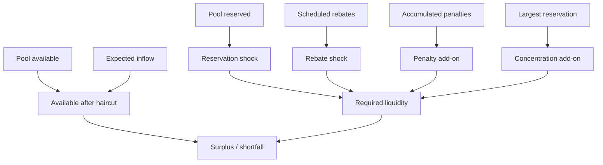
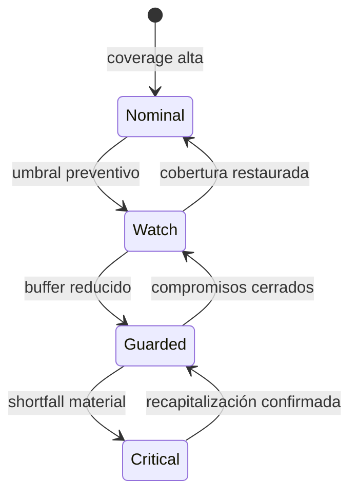
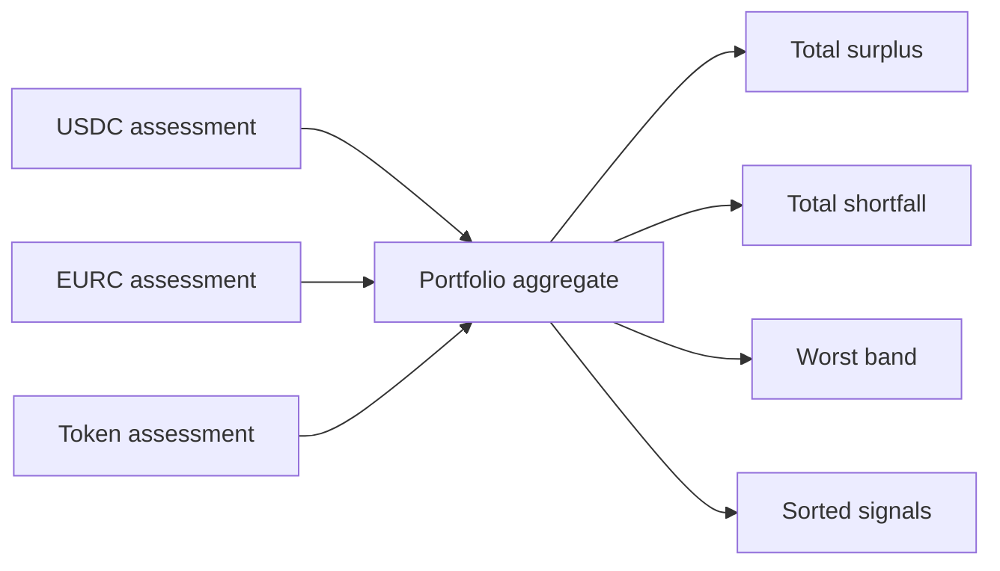

# Tesorería y pruebas de stress

El módulo `treasury` transforma posiciones por activo en una evaluación de liquidez reproducible. No modifica reservas ni balances: consume un snapshot, aplica shocks conservadores y devuelve métricas, una banda de capital y señales operativas.

## Waterfall de capital



```text
available_after_haircut = floor((available + expected_inflow) × (1 - haircut))
required = shocked_reserved + shocked_rebates + penalty_addon + concentration_addon
coverage_bps = available_after_haircut × 10_000 / max(required, 1)
```

Los productos que redondean requerimientos usan techo; los recursos disponibles usan suelo. Esta asimetría evita mejorar artificialmente la posición por fracciones descartadas.

## Bandas y controles



| Banda      | Lectura             | Acción sugerida                            |
| ---------- | ------------------- | ------------------------------------------ |
| `nominal`  | holgura suficiente  | operación ordinaria                        |
| `watch`    | margen en descenso  | reducir límites y observar concentración   |
| `guarded`  | buffer comprometido | limitar nuevas reservas y elevar revisión  |
| `critical` | déficit bajo stress | pausar admisión del activo y recapitalizar |

La aplicación de estas acciones corresponde al plano de control. La evaluación aporta señales deterministas para que el integrador implemente su política de pausa.

## Cartera multi-activo



La suma de importes solo es válida si las unidades son comparables. En producción, el consumidor debe mantener evaluaciones por activo y usar una capa externa de valoración para equivalentes monetarios. `assess_portfolio` detecta activos duplicados, ordena resultados y expone la peor banda para facilitar un gate conservador.

## Escenarios recomendados

- aumento simultáneo de reservas y rebates programados;
- haircut de liquidez por ventanas de retiro;
- concentración de una sola reserva frente al pool;
- inflow esperado igual a cero;
- penalizaciones acumuladas con recuperación parcial;
- sensibilidad de umbrales a incrementos de 100 bps.

Cada escenario debe guardar input, versión de política, resultado y digest. Las comparaciones se realizan contra un baseline aprobado, nunca contra el último valor observado sin contexto.
