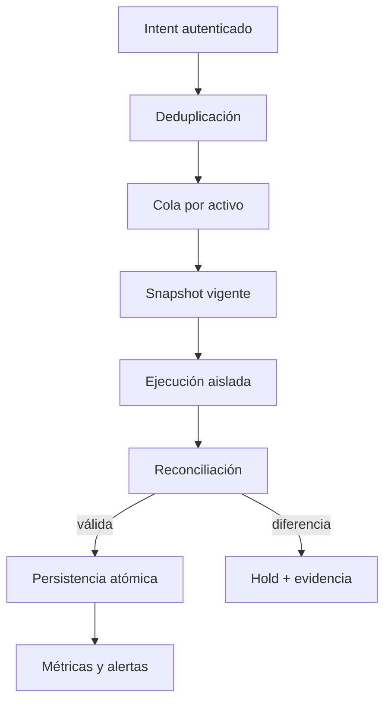
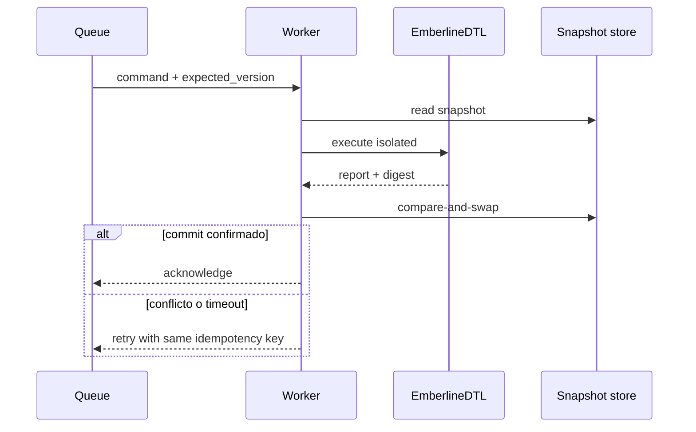
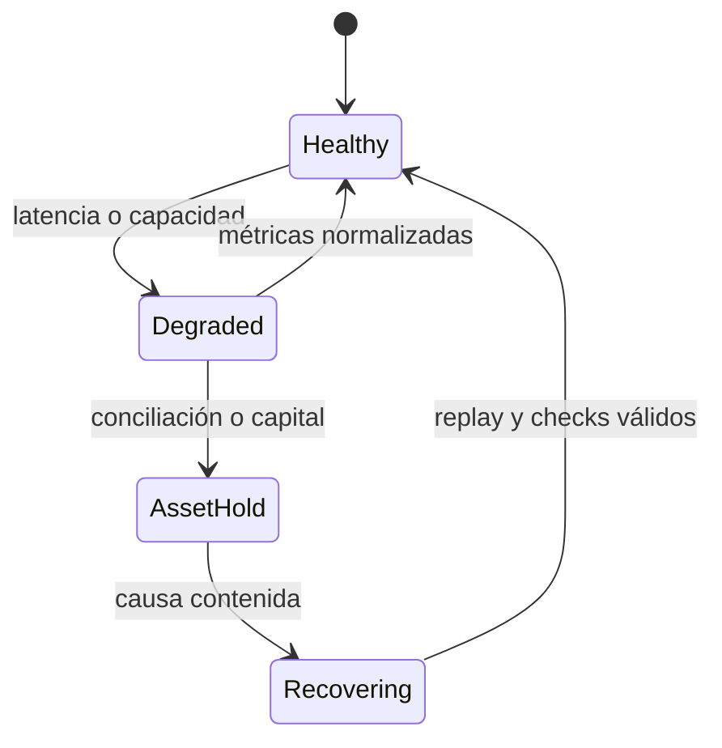

# Operación y continuidad

La operación segura requiere tratar cada ejecución como una transición versionada. El binario puede reconstruir resultados, pero la disponibilidad, autenticación, orden y persistencia pertenecen al servicio que lo integra.

## Flujo operativo

El identificador de idempotencia debe vincular tenant, comando, activo y versión esperada. Repetir un comando completado devuelve el resultado persistido; no vuelve a ejecutar el motor.

## Recuperación ante fallos

Un timeout no demuestra que la transición no terminara. Antes de reintentar, el worker consulta el registro de idempotencia y la versión del snapshot. Los mensajes fallidos se envían a una cola de revisión conservando hashes, sin credenciales ni payloads sensibles.

## Estados de servicio

`AssetHold` afecta únicamente al activo y versión implicados. Las rutas ya reservadas requieren una decisión explícita: completar, cancelar o migrar; no deben permanecer indefinidamente sin propietario operativo.

## Runbook mínimo

1. Identificar activo, snapshot, route ID y reservation ID.
2. Detener nuevas reservas del activo sin borrar la cola.
3. Capturar binario, política, input, output y hashes.
4. Reproducir con el mismo snapshot en un entorno aislado.
5. Comparar pool, postings, balances y digest.
6. Aplicar la decisión aprobada y ejecutar replay ordenado.
7. Restaurar admisión gradualmente y observar cobertura.

## Objetivos de servicio

Se recomienda medir p50/p95/p99 de ejecución, profundidad de cola, edad máxima de reserva, tasa de rechazos por código, conflictos de versión, diferencias de reconciliación y banda de tesorería. Un SLO de latencia no debe incentivar saltarse conciliación o reutilizar snapshots obsoletos.
