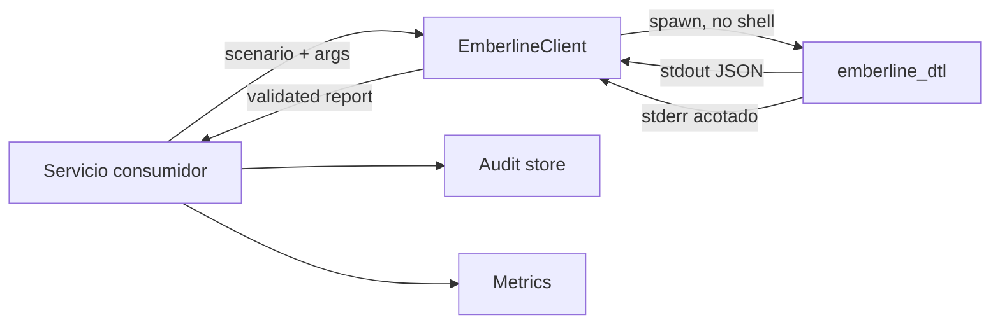
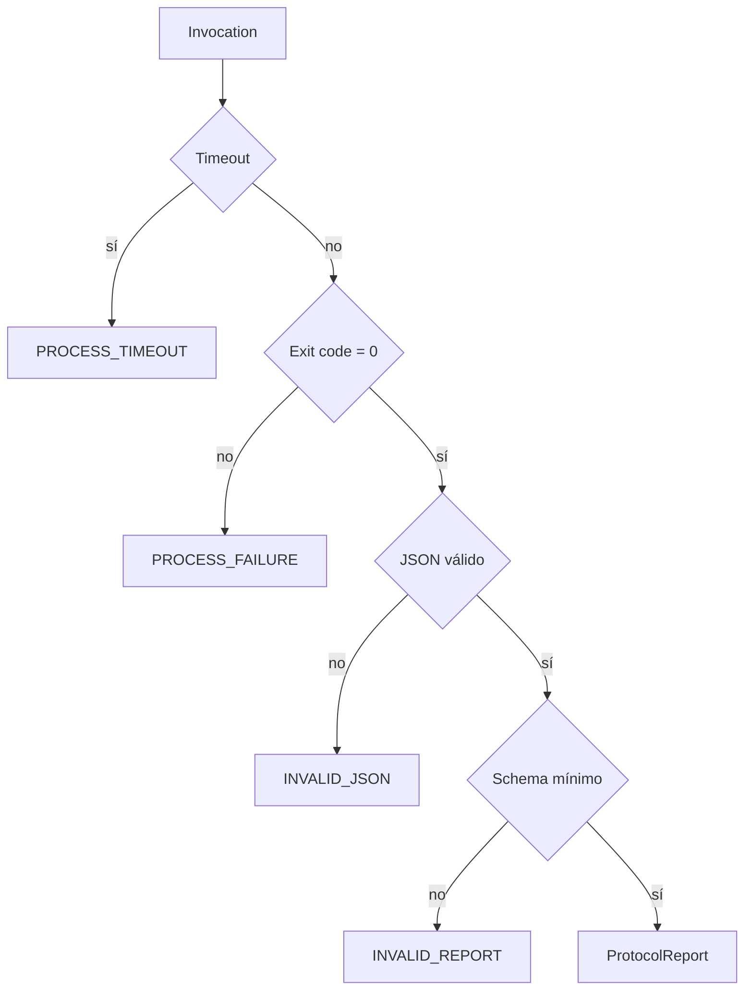
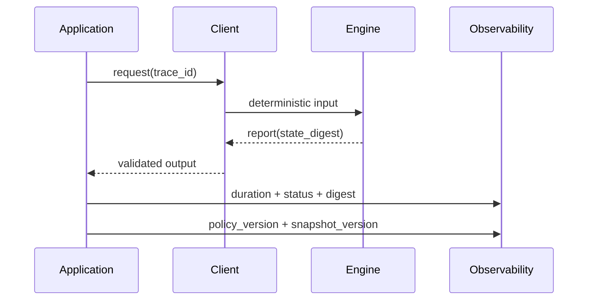

# Integración y observabilidad

El contrato de integración es la salida JSON del binario. El cliente JavaScript inicia el proceso sin shell, impone timeout y límite de buffer, valida la forma del reporte y propaga errores con contexto acotado.

## Frontera de integración



El path del binario debe configurarse de forma absoluta o resolver a un artefacto aprobado. No se aceptan argumentos construidos desde texto libre. En servicios concurrentes, cada invocación recibe un directorio temporal propio y límites de CPU/memoria del runtime.

## Contrato de errores



Los errores no deben registrar comandos de autenticación, secretos o datos personales. Para diagnóstico bastan código, versión del binario, duración, tamaño de salida, escenario permitido y hash del input.

## Trazabilidad



Campos recomendados:

| Campo              | Tipo             | Cardinalidad     |
| ------------------ | ---------------- | ---------------- |
| `protocol_version` | label            | baja             |
| `scenario`         | label controlada | baja             |
| `asset`            | label permitida  | media            |
| `result_code`      | label            | baja             |
| `duration_ms`      | histograma       | n/a              |
| `state_digest`     | log estructurado | alta, no métrica |
| `route_id`         | traza/log        | alta, no métrica |

## Ejemplo de cliente

```js
import { EmberlineClient } from "../sdk/client.js";

const client = new EmberlineClient({
  binaryPath: process.env.EMBERLINE_BINARY,
  timeoutMs: 5_000,
  maxBufferBytes: 2 * 1024 * 1024,
});

const result = client.runScenario("normal");
if (!result.state_digest) throw new Error("Missing state digest");
```

La aplicación debe fijar una lista de escenarios permitidos. Para entradas dinámicas se recomienda añadir un canal estructurado versionado en vez de convertir propiedades externas en argumentos de terminal.
