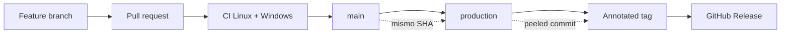
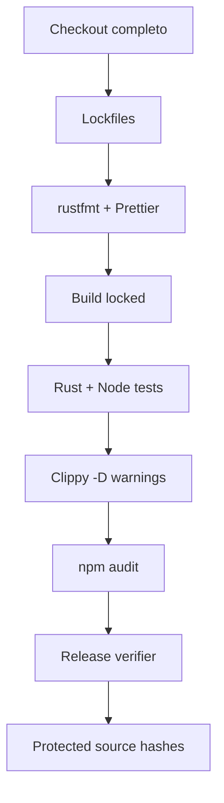
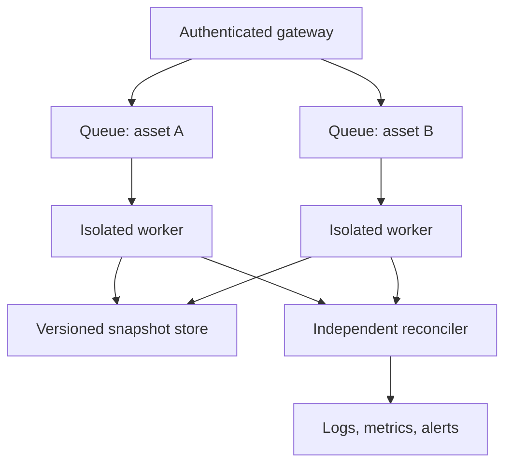

# Despliegue y promoción

Las entregas estables siguen una cadena inmutable: revisión en pull request, integración en `main`, promoción del mismo commit a `production`, tag anotado y release. No se recompone código entre etapas.

## Cadena de promoción



La integridad de release verifica que `production` apunte exactamente a `main` y que el tag se resuelva al commit de `production`. Un tag ligero no cumple la política.

## Pipeline de calidad



El workflow utiliza permisos de lectura y versiones fijadas de Rust y Node. Las credenciales de publicación pertenecen a GitHub y no entran en el proceso de build.

## Topología de ejecución



## Preparación

```bash
npm ci
cargo build --release --locked
npm run ci
```

El artefacto debe identificarse con SHA-256, versión de Rust, target triple y commit. Si se empaqueta en contenedor, se fija el digest de la imagen base y se ejecuta con filesystem de solo lectura, usuario sin privilegios y límites de recursos.

## Rollback

Rollback significa volver a un artefacto y esquema de snapshot compatibles. Antes del cambio se valida:

- compatibilidad del formato persistido;
- política económica asociada al artefacto anterior;
- reservas creadas por la versión actual;
- capacidad de replay del journal;
- igualdad de digests en un conjunto canario.

Si el estado no es retrocompatible, se mantiene el binario actual en `AssetHold` hasta completar una migración explícita. Nunca se fuerza un binario anterior sobre snapshots desconocidos.

## Evidencia de entrega

Conserve los enlaces de CI de pull request, `main`, `production`, tag y release; los SHAs de commit, tag y banner; el resultado de las suites; y el manifiesto de archivos protegidos. Esta evidencia permite demostrar que se publicó exactamente lo revisado.
